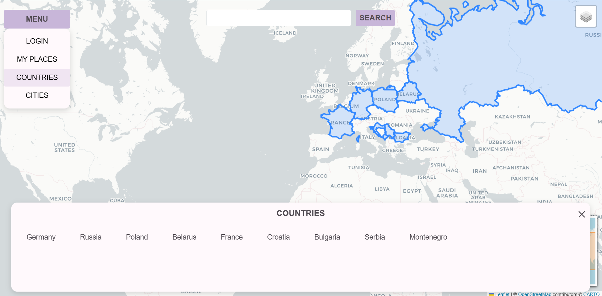
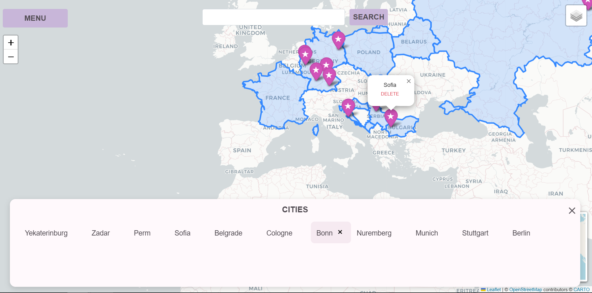

Hi! This is my first project using Python and JavaScript: “My Places.”
My Places is a website where you can keep track of the cities and countries you have visited. You can search for a city or country, save it to your personal map, and see all your saved places in one place. You can also view your saved cities and countries separately, and delete them whenever you want.

How to run:
1. Clone the repository.
2. Create and activate a virtual environment:
python -m venv .venv
3. On Windows, activate the virtual environment:
.venv\Scripts\activate
4. Install the required dependencies:
pip install -r requirements.txt
5. Create a `.env` file in the project root and add:
SECRET_KEY=your-secret-key
6. Run the application from the project root:
python main.py
7. Open the local address shown in the terminal.

```text
map_project/
├── .github/
│   └── workflows
│       └── tests.yml
├── backend/
│   ├── __init__.py
│   ├── borders.py
│   ├── database.py
│   └── search_api.py
├── data/
│   └── countries.geojson
├── frontend/
|   ├── static
|       └── css/
|           └── main.css
│   ├── templates/
│       ├── home.html
│       ├── list.html
│       └── my_places.html
│   ├── __init__.py
│   ├── map.py
│   └── website.py
├── screenshots/
├── tests/
│   ├── __init__.py
│   ├── test_borders.py
│   ├── test_database.py
│   ├── test_map.py
│   ├── test_search_api.py
│   └── test_website.py
├── .gitignore
├── README.md
├── __init__.py
├── main.py
└── requirements.txt
```


It is a two-page website. You can register an account, and after registration, you are assigned a unique user ID.


I've added search functionality for countries and cities. Once a location is found, a corresponding marker with its name appears on the map, along with a “Save” button.


You can view your saved cities and countries together or separately by using the map layers control in the upper-right corner.


Cities and countries can also be viewed using drop-down lists. 



The system allows you to delete saved locations either from the lists or, for cities only, directly from their markers on the map.



For this project, I used Python, Flask, Werkzeug, python-dotenv, Folium, Requests, Gunicorn, and Pytest. My project is organized into four main folders: `backend`, `data`, `frontend`, and `tests`.

The `data` folder contains countries.geojson, which stores the GeoJSON data used to display country borders on the map.

The `backend` folder contains the main backend logic:
- `search_api.py`: sends requests to the Nominatim API to retrieve location data and coordinates for countries and cities that the user wants to add to the map.
- `database.py`: creates and manages the SQLite database. It contains functions for saving, deleting, and retrieving users' countries and cities.
- `borders.py`: processes the GeoJSON data from the data folder and uses it to create layers for visited countries.

The visual and interactive parts of the application are organized in the `frontend` folder:
- `map.py`: creates and configures the map.
- `website.py`: contains the Flask routes and handles communication between the frontend, backend, and database.
The templates folder contains the HTML files for the website pages.

To ensure that the main parts of the application work correctly, I added automated `tests` in the tests folder.

The project also includes `main.py` as the main entry point, `requirements.txt` with the project dependencies.
