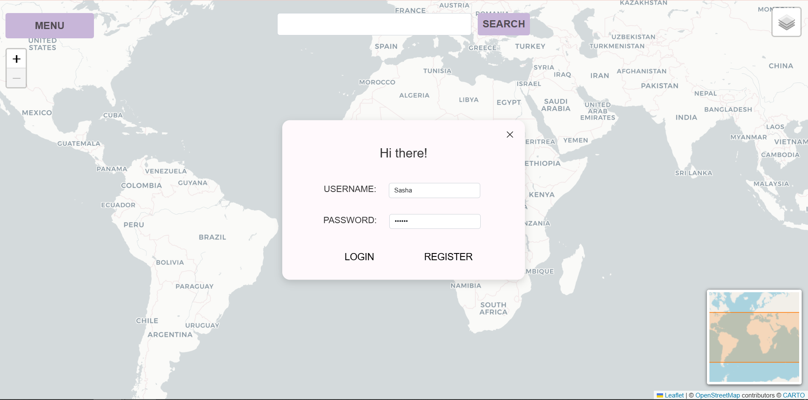
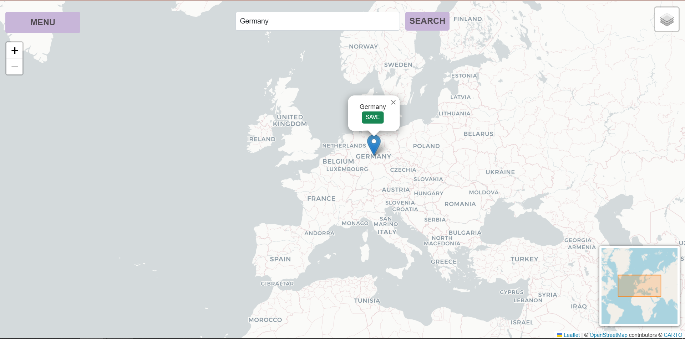
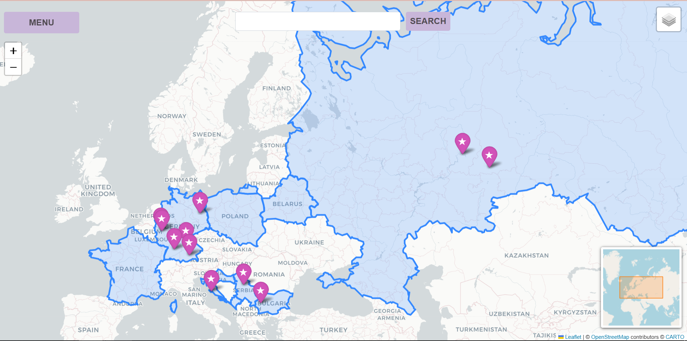

Hi! This is my first project using Python and JavaScript: “My Places.”
My Places is a website where you can keep track of the cities and countries you have visited. You can search for a city or country, save it to your personal map, and see all your saved places in one place. You can also view your saved cities and countries separately, and delete them whenever you want.

```text
map_project/
├── README.md
├── main/
│   └── main.py
├── backend/
│   ├── __init__.py
│   ├── borders.py
│   ├── database.py
│   ├── search_api.py
│   └── places.db
├── frontend/
│   ├── map.py
│   ├── website.py
│   ├── static/
│   │   └── main.css
│   └── templates/
│       ├── home.html
│       ├── list.html
│       └── my_places.html
├── data/
│   └── countries.geojson
└── screenshots/
```


It is a two-page website. You can register an account, and after registration, you are assigned a unique user ID.



I've added search functionality for countries and cities. Once a location is found, a corresponding marker with its name appears on the map, along with a “Save” button.



You can view your saved cities and countries together or separately by using the map layers control in the upper-right corner.



Cities and countries can also be viewed using drop-down lists. 


The system allows you to delete saved locations either from the lists or, for cities only, directly from their markers on the map.


For this project, I used SQLite, Flask, Folium, and Requests.
My project structure consists of three main folders: data, backend, and frontend.
In the data folder, I store the GeoJSON data containing country borders.
The backend folder contains three main files:
- search_api.py: sends requests to Nominatim to retrieve coordinates for locations that I want to add to the map.
- database.py: creates and manages the database. It also contains all the functions for saving, deleting, and retrieving data from the database.
- borders.py: processes the GeoJSON data from the data folder and uses it to draw the layers of visited countries on the map.

In the frontend, I create the map in map.py and the website itself in website.py. The templates folder contains the HTML structure of the website's pages, while the static folder contains the CSS used to design the website.
